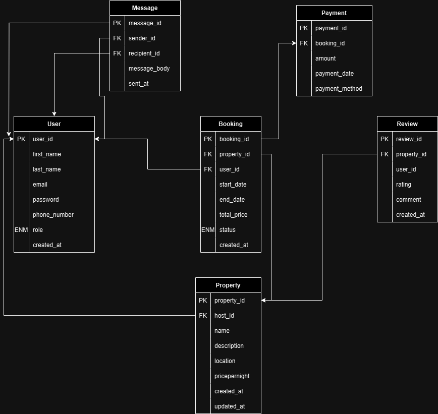

# Entity-Relationship Diagram (ERD) for Airbnb Database

## Overview
This document outlines the Entity-Relationship (ER) diagram for the Airbnb database, detailing the entities, their attributes, and the relationships between them.

## Entities and Attributes
1. **User**
   - `user_id` (Primary Key)
   - `first_name`
   - `last_name`
   - `email`
   - `password_hash`
   - `phone_number`
   - `role`
   - `created_at`

2. **Property**
   - `property_id` (Primary Key)
   - `host_id` (Foreign Key, references User)
   - `name`
   - `description`
   - `location`
   - `pricepernight`
   - `created_at`
   - `updated_at`

3. **Booking**
   - `booking_id` (Primary Key)
   - `property_id` (Foreign Key, references Property)
   - `user_id` (Foreign Key, references User)
   - `start_date`
   - `end_date`
   - `total_price`
   - `status`
   - `created_at`

4. **Payment**
   - `payment_id` (Primary Key)
   - `booking_id` (Foreign Key, references Booking)
   - `amount`
   - `payment_date`
   - `payment_method`

5. **Review**
   - `review_id` (Primary Key)
   - `property_id` (Foreign Key, references Property)
   - `user_id` (Foreign Key, references User)
   - `rating`
   - `comment`
   - `created_at`

6. **Message**
   - `message_id` (Primary Key)
   - `sender_id` (Foreign Key, references User)
   - `recipient_id` (Foreign Key, references User)
   - `message_body`
   - `sent_at`

## Relationships
- **User** (1) ↔ (N) **Property** (host_id)
- **User** (1) ↔ (N) **Booking** (user_id)
- **Property** (1) ↔ (N) **Booking** (property_id)
- **Booking** (1) ↔ (1) **Payment** (booking_id)
- **User** (1) ↔ (N) **Review** (user_id)
- **Property** (1) ↔ (N) **Review** (property_id)
- **User** (1) ↔ (N) **Message** (sender_id)
- **User** (1) ↔ (N) **Message** (recipient_id)

## ER Diagram
  <!-- Update this path to your actual diagram file -->

## Conclusion
This ER diagram provides a comprehensive overview of the Airbnb database structure, highlighting the relationships and attributes necessary for implementation.